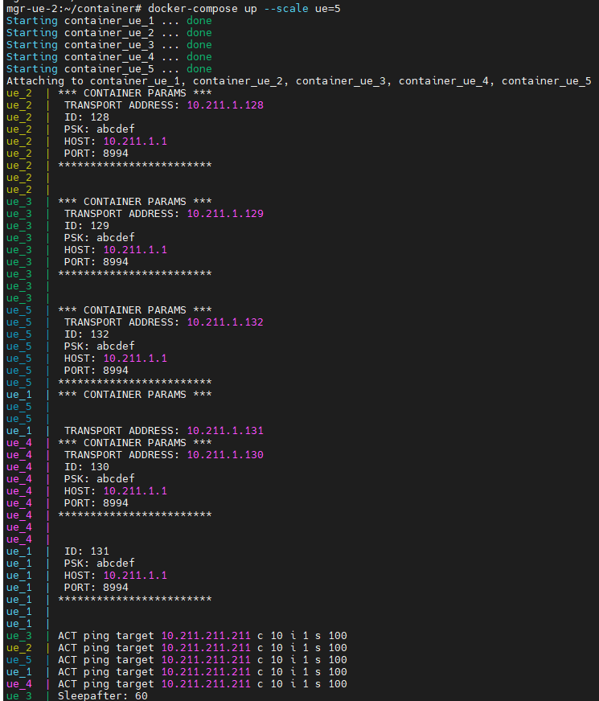

# FakeUE Container Version

## Intro
docker-compose, with a MACVLAN or IPVLAN networking, can easily span up multiple FakeUE Virtual Devices.

## Env Preparation
docker's *daemon.json* will have:
```
{
  "bip": "10.211.248.1/29",
  "iptables": false
}
```

MACVLAN network can be created with:
```
docker network create -d macvlan --subnet=10.211.1.0/24  --ip-range=10.211.1.128/28 --gateway=10.211.1.1 -o parent=eth1 fakebackbone
```
(*ip range: 10.211.1.128-10.211.1.143*)

On GCP, I had to use IPVLAN with L3 mode:
```
docker network create -d ipvlan --subnet=10.211.1.0/24 --ip-range=10.211.1.128/28 --gateway=10.211.1.1 -o parent=ens4 -o ipvlan_mode=l3 fakebackbone
```

## Scaling
```
docker-compose up --scale ue=5
```

## Example


