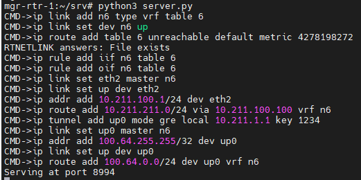
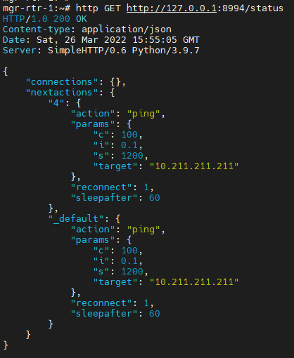
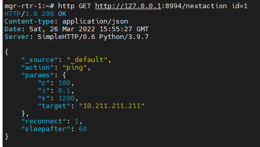
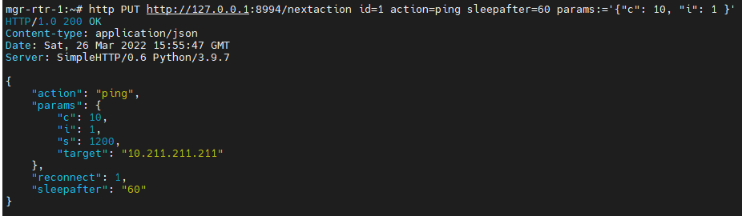
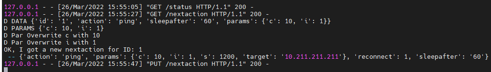
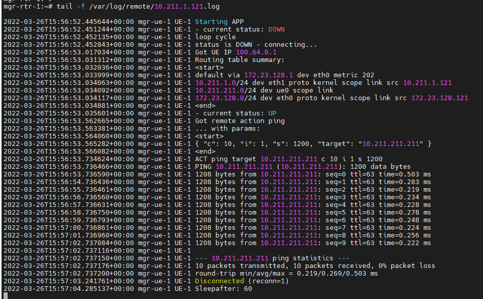
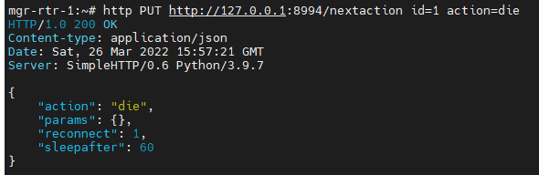
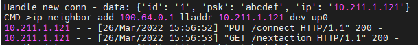
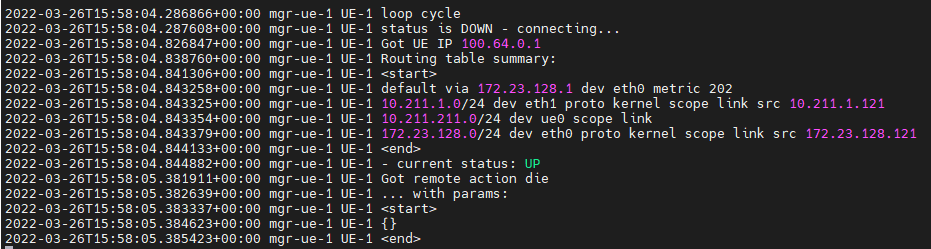
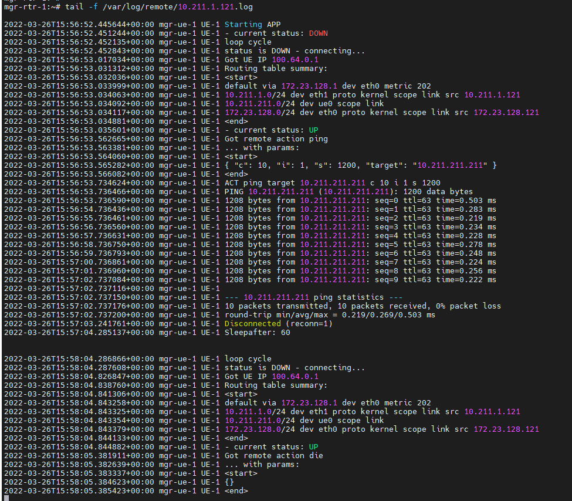

# FakeGateway DEMO

## Server starting...
VRF and main tunnel is created. Listening on port http **8994**.

## Fetching the server status
With the list of existing connections, and client next actions.

## Show next action for client ID=1

## Setting next action (ping) for client ID=1

with server logs:

## Remote Syslogs for CLIENT_LOOP (connect and ping)

## Setting next action (die) for client ID=1

## Server logs for client connection

## Remote Syslogs for CLIENT_LOOP (next action: die)

## Remote Syslogs for CLIENT_LOOP (complete log)

Also available as [TXT](./demo/complete_log.txt)
